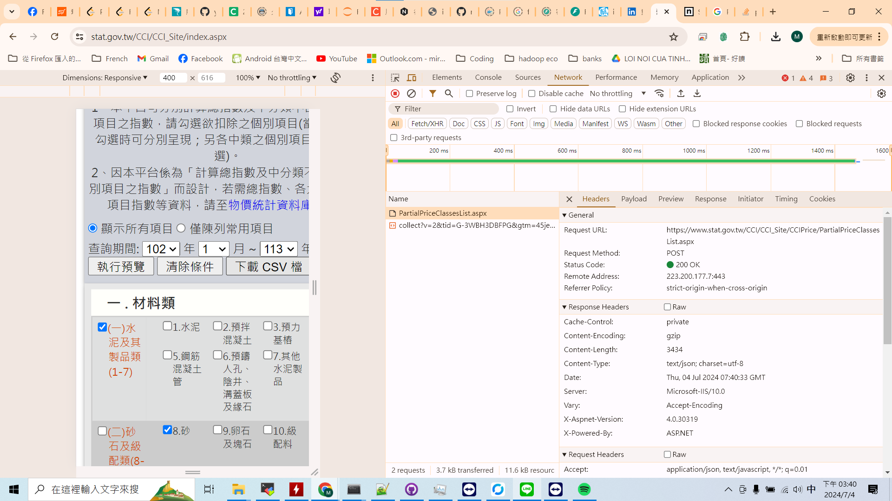
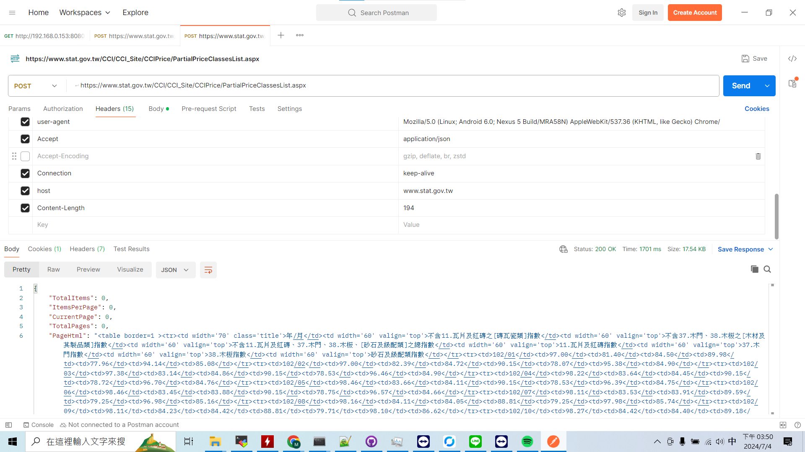

# CCI資料爬蟲

## 剛好看到PTT上有爬蟲的案子就研究了一下，雖然最後沒接到這個案子  
### CCI資料頁面:<a href="https://www.stat.gov.tw/CCI/CCI_Site/index.aspx">https://www.stat.gov.tw/CCI/CCI_Site/index.aspx/</a>
### 初步看起來用selenium一定可以做，但想到chrome更新的頻率加上要把webdriver包進程式裡，想到就覺得有點頭大  

### 先試著下載資料看看
用開發者工具看了一下下載的請求，感覺可以直接用requests的方式去解這個問題  
  
接著用postman嘗試了一下，看起來是可以成功拿到資料的，只是需要手動轉成csv  
  

### 確定資料可以取得之後就可以開工用requests來爬取資料了  
<li><a href="./cci_crawler.ipynb">用postman輸出r</a></li>
